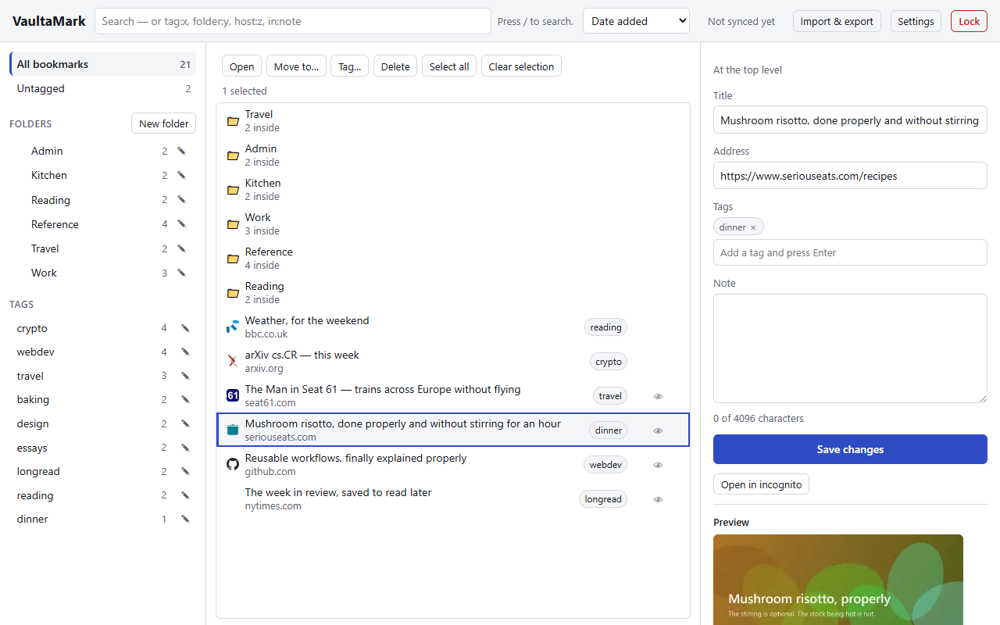
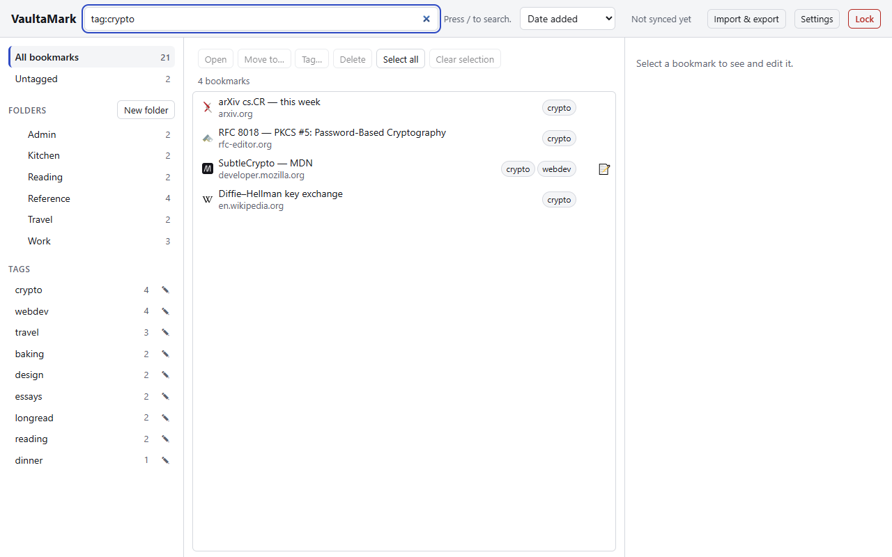
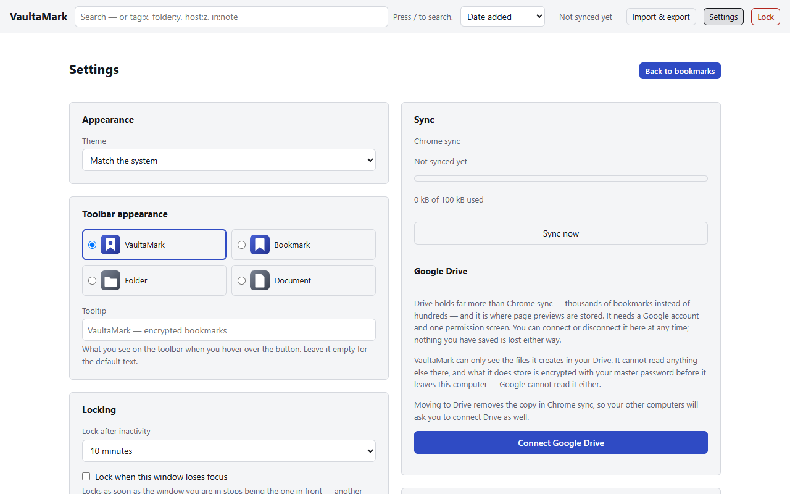
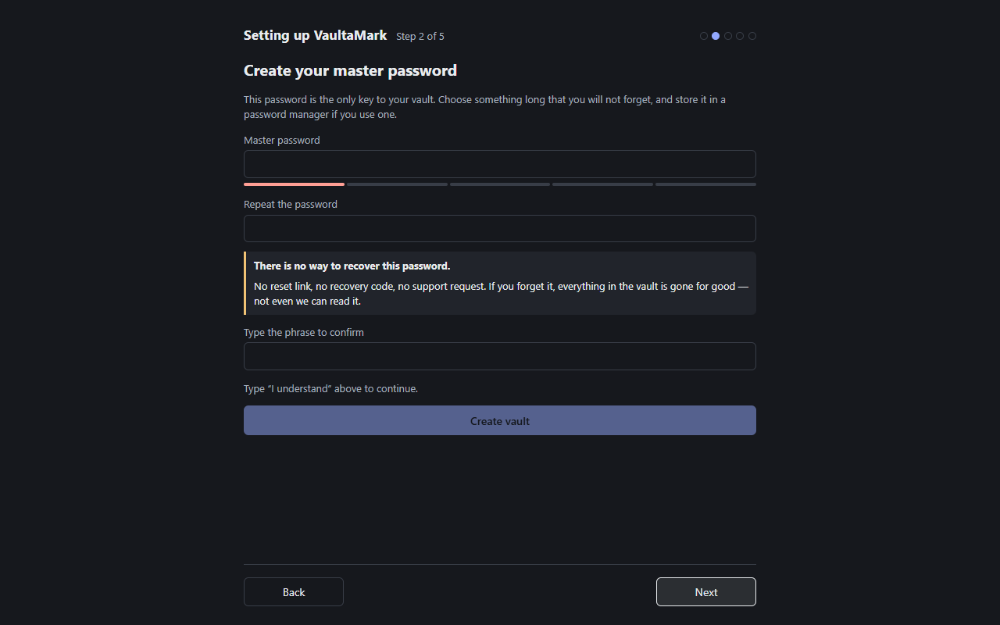

# VaultaMark

> **Encrypted bookmarks that never touch your omnibox — synced through your own Google Drive.**

[](https://github.com/zyndata/vaulta-mark/actions/workflows/ci.yml)
[](https://github.com/zyndata/vaulta-mark/releases)
[](LICENSE)
[](https://chromewebstore.google.com/detail/nfcfgnaefnkpmoiagnamdacpohifncpl)

VaultaMark is a Manifest V3 Chrome extension that keeps your bookmarks in a password-encrypted vault
stored **completely outside** Chrome's bookmark and history systems. Chrome never learns those URLs
are bookmarks, so they can never appear in address-bar autocomplete. Everything opens in an incognito
window. Nothing leaves your machine unless you explicitly connect your own Google Drive.

**Repository:** <https://github.com/zyndata/vaulta-mark>

**Status: published.** VaultaMark is [in the Chrome Web Store][store], every phase in
[PLAN.md](PLAN.md) is built and tested, and the source is public under GPL-3.0-only
([PLAN.md §2.5, D36](PLAN.md#25-project--process)) — for a tool that asks you to trust it with an
unrecoverable password, being readable is part of the product. Every release is built from a tag by
a GitHub Actions workflow, so the package in the Store and the source in this repository are the
same thing twice. The privacy policy is served at <https://zyndata.github.io/vaulta-mark/PRIVACY>.

---

## Why VaultaMark

- **Synced through *your own* Google Drive.** Optional, opt-in, `drive.file` scope only — the
  extension can only see the file it created. There is no VaultaMark server, because there is no
  VaultaMark company.
- **Stored entirely outside `chrome.bookmarks`.** This is the whole point: vaulted URLs cannot
  autocomplete in the address bar, because Chrome does not know they are bookmarks.
- **Discord-style link previews.** The page's Open Graph image is captured **once**, when you save the
  bookmark, then encrypted. Browsing your vault makes **zero** network requests, ever.
- **Every vaulted link opens in an incognito window.** No history, no cache, no trace.
- **A QR code, for moving one address to a phone** without retyping it or mailing it to yourself.
  It is drawn only when you ask for it, and it says plainly what it cannot do: no browser on either
  mobile platform lets a scanned link open in a private tab, so the page opens in an ordinary one.
- **Finds the same page saved twice.** *Duplicates* in the manager's sidebar counts the addresses
  your vault holds more than once and lists the copies side by side — title, folder, tags, note,
  date — so you can keep the one you meant. Nothing is ticked for you. It matters most for a vault
  built by importing your browser's bookmarks, or grown on two computers. It does **not** check
  whether links are still alive: that would mean requesting every one of them, and browsing your
  vault makes no requests at all.
- **One-click history cleanup for vaulted domains** — closes the "but I visited it once" leak that
  bookmark-only tools miss.
- **Zero config by default.** Chrome sync works out of the box with no OAuth and no extra
  permissions. Connect Drive when you want more room and previews.

## Screenshots

| | |
| --- | --- |
|  |  |
| **The vault** — folders, tags, favicons from Chrome's local cache, and the page's own preview drawn in the detail pane. | **Search** — `tag:`, `folder:`, `host:` and `in:` prefixes, reaching into folders. |
|  |  |
| **Sync** — Chrome sync by default with its quota in view; Drive is one button and a permission screen. | **Setup** — the constraint stated before you can get past it, and a phrase you have to type. |

Everything in the pictures is invented: real destinations, made-up titles and folders. They are
regenerated from a real build by `node scripts/capture-store-screenshots.mjs`.

## Install

**[Install from the Chrome Web Store][store]** — the ordinary way, and the one that keeps
itself updated. What the listing says is drafted in [docs/STORE_LISTING.md](docs/STORE_LISTING.md).

**From source**, if you would rather run something you built yourself:

```bash
npm ci
npx vite build --mode development     # → dist/
```

Then `chrome://extensions` → enable **Developer mode** → **Load unpacked** → select `dist/`. Also
enable **Allow in incognito** on the extension's details page, or opening a bookmark cannot do the
one thing it promises.

Use `--mode development` rather than `npm run build` if you intend to connect Google Drive: the
development build carries a manifest `key` that pins the extension id, and the OAuth client is
registered against exactly one id. `npm run build` is the *packaging* command — correct for the
Store, which assigns its own id, and the cause of an otherwise unexplainable
`Error 400: redirect_uri_mismatch` if you install it locally and connect Drive
([docs/RELEASE.md §5.4](docs/RELEASE.md#54-stable-extension-id-for-local-development)).

**Verifying a published zip.** Every GitHub Release carries `SHA256SUMS` alongside the package. To
check it against your own build:

```bash
git checkout v1.0.0
npm ci && npm run build && npm run zip     # prints the sha256 it just wrote
sha256sum release/vaulta-mark-1.0.0.zip
```

The zip **container** is byte-for-byte deterministic by construction — fixed timestamps, sorted
entries, no extra fields, all of it in `scripts/zip.mjs` rather than trusted to a library. The
**bundle inside it** is not promised to be: it comes out of a minifier and a toolchain whose exact
version is yours, not ours. So a matching hash proves a great deal and a differing one proves
nothing on its own — compare the unzipped files if it differs. This is deliberately a weaker claim
than "reproducible build", because a reproducible build is a thing you engineer, and we have not.

## How it works

Your master password never leaves your machine and is never stored. It is stretched with
**PBKDF2-HMAC-SHA256 (600,000 iterations)** and a per-vault random salt into a key-encryption key,
which unwraps a random 256-bit vault key. Every title, URL, folder name, tag, note, and thumbnail is
encrypted with **AES-256-GCM** — 96-bit random IV, authenticated, with additional data binding each
ciphertext to its schema version, purpose, and slot — before it touches storage of any kind.

There is no password verifier blob: a wrong password simply fails the authentication tag. Plaintext is
compressed and padded to a 256-byte boundary before encryption, so ciphertext size says little about
what is inside. While the vault is unlocked, the key lives in `chrome.storage.session` — memory only,
never on disk, gone when Chrome exits or the idle timer fires.

Full specification: [docs/ARCHITECTURE.md §4](docs/ARCHITECTURE.md#4-cryptography).

## What it protects — and what it doesn't

**Protects against:** someone browsing your machine or your Chrome profile; address-bar autocomplete
revealing vaulted URLs while you type; anyone reading `chrome.storage` on disk or in a profile backup;
Google, or anyone with access to your Drive, reading the vault; a stolen exported backup file.

**Does not protect against:** a compromised operating system or user account while the vault is
unlocked; a keylogger; another extension with debugger access to our pages; a weak master password
(there is a strength meter and a 10-character floor, but the rest is yours); an attacker who already
has your unlocked machine.

**Known, documented leaks:** the plaintext vault header (encryption parameters and a revision
counter — it reveals that a vault exists and roughly how big it is, nothing about its contents),
ciphertext length, and the existence and timestamps of the Drive file if you sync there.

Full threat model: [docs/ARCHITECTURE.md §8](docs/ARCHITECTURE.md#8-threat-model). Reporting policy:
[SECURITY.md](SECURITY.md).

## ⚠️ The one warning

**There is no password recovery. None.** Not by us, not by Google, not by anyone. The master password
is never stored or transmitted, and no recovery key exists. If you forget it, your vault is
permanently unreadable — that is the design, not a limitation. It is also the reason nobody can be
compelled to hand your bookmarks over.

Use the encrypted export as your backup. Keep the password somewhere you trust.

## Sync tiers

| | **Chrome sync** (default) | **Google Drive** (opt-in) |
| --- | --- | --- |
| Setup | none | one OAuth grant, `drive.file` scope |
| Capacity | ~600 bookmarks comfortably, ~1,000 measured | effectively unlimited |
| Links, titles, tags, notes, folders | ✅ | ✅ |
| Favicons | ✅ | ✅ |
| OG-image thumbnails | ❌ | ✅ |
| Where it lives | your Chrome profile sync | a normal file in your own Drive |

Both tiers store **ciphertext only**. You can switch either direction; Drive is never required, and
disconnecting it leaves the file in your Drive for you to delete.

## Permissions

VaultaMark requests **no host permissions at install time** and no permission that produces an install
warning. History, bookmarks, Drive, and idle access are **optional** and requested only when you use
the feature that needs them.

| Permission | Why | |
| --- | --- | --- |
| `storage` | Stores the encrypted vault and your settings; syncs the encrypted vault between your own Chrome profiles. | required |
| `activeTab` | Reads the current tab's title, URL, and preview metadata **at the moment you save it**. | required |
| `scripting` | Injects one script into that tab, only when you save it, to read the preview metadata. | required |
| `contextMenus` | Adds the "Save to VaultaMark" right-click entry. | required |
| `alarms` | Auto-locks the vault after your idle timeout. | required |
| `favicon` | Shows site icons from Chrome's **local** cache — never a third-party favicon service. | required |
| `identity` + `googleapis.com` | Google Drive sync. | optional |
| `history` | History cleanup for vaulted domains — the one-click tool, clearing on lock, and quick-close. | optional |
| `bookmarks` | Importing your existing Chrome bookmarks. | optional |
| `idle` | Locking on system idle. | optional |

Why `scripting` needs no host permission: `activeTab` is granted by all four save entry points
(toolbar, context menu, keyboard shortcut, popup), so the extension never needs broad access to the
sites you visit.

## Languages

**English and Polish.** VaultaMark follows **Chrome's own language** — if Chrome is in Polish, so is
VaultaMark. A language it does not have falls back to English, one message at a time, so a
translation that is only half finished shows English in the gaps rather than blank labels.

**There is no language picker inside VaultaMark, and that is deliberate.** `chrome.i18n` takes its
language from the browser and offers no supported override; building a picker means replacing it
with our own message loader, and even then the name and description Chrome shows on
`chrome://extensions` and in the Web Store would keep following the browser. A picker that changes
some of the product's words and not others is worse than none. The full reasoning is in
[ARCHITECTURE §18.4](docs/ARCHITECTURE.md#184-there-is-no-in-app-language-picker-and-there-will-not-be-one).

**Translations are welcome.** Copy `public/_locales/en/messages.json`, translate the `message`
fields, and open a PR — `npm run verify` will tell you what is missing, including the plural forms
your language has and English does not. See [CONTRIBUTING.md](CONTRIBUTING.md).

## Privacy

**No telemetry. No analytics. No error reporting. No accounts. No network calls at all** — except to
your own Google Drive, and only once you have connected it. This is enforced in CI, not just promised:
see the [hard invariants](PLAN.md#4-hard-invariants), one of which is an end-to-end test asserting
that browsing the vault produces **zero** network requests.

Privacy policy: [docs/PRIVACY.md](docs/PRIVACY.md)

## Development

**Requirements:** Node 24 LTS (pinned in [`.nvmrc`](.nvmrc)) and npm. Nothing else.

```bash
npm ci
npm run dev          # watch build, development mode → dist/
npm run build        # production build, for packaging
npm run verify       # lint + type-check + tests + build + invariant scan + size budgets
npm run test         # unit + integration
npm run test:e2e     # Playwright, against a real Chromium with the extension loaded
npm run zip          # → release/vaulta-mark-<version>.zip
```

`npm run verify` is the gate — it runs before every push, because CI can report a failure but
cannot block a direct commit ([docs/BRANCH_PROTECTION.md](docs/BRANCH_PROTECTION.md)). Which build
variant to install is the same question the [Install](#install) section answers.

Full setup, the build layout, the invariant scanners and the manual passes an automated harness
cannot perform: [docs/DEVELOPMENT.md](docs/DEVELOPMENT.md).

## Architecture

[docs/ARCHITECTURE.md](docs/ARCHITECTURE.md) — component map, crypto, vault format, storage layout,
the sync and merge algorithm, the threat model, Drive integration, and thumbnails. It is normative:
the code follows the spec, and a change to one lands with a change to the other.

## Releases

[docs/RELEASE.md](docs/RELEASE.md) — branching, CI, tagging, Google Cloud and OAuth setup, and Chrome
Web Store publishing. User-visible changes are recorded in [CHANGELOG.md](CHANGELOG.md).

## Contributing

VaultaMark has **one maintainer**, and issues, discussions and pull requests are all open. Bug
reports and questions are genuinely welcome. Pull requests are read and judged on their merits —
there is no roadmap soliciting them, and a large one is worth an issue before it is worth your
weekend.

[CONTRIBUTING.md](CONTRIBUTING.md) is the entry point — branching model, Conventional Commits, DCO
sign-off, how to run the tests, and the rules that are not negotiable (zero runtime dependencies, no
remote code, no plaintext anywhere, and no crypto pull request without a linked issue first).
[CODE_OF_CONDUCT.md](CODE_OF_CONDUCT.md) applies to everyone here.

## Security

Report vulnerabilities **privately** through
[GitHub Security Advisories](https://github.com/zyndata/vaulta-mark/security/advisories/new) — see
[SECURITY.md](SECURITY.md) for scope, timelines, and what to include. Please do not open a public
issue for a security problem — a public report starts the clock for every user before a fix exists.

## License

[GPL-3.0-only](LICENSE) — Copyright (C) 2026 zyndata.

VaultaMark is a security tool. Copyleft keeps every fork auditable, which is the point: you can read
what encrypts your bookmarks, build it yourself, and check that the extension you installed is the
one this source produces ([docs/RELEASE.md](docs/RELEASE.md)).

[store]: https://chromewebstore.google.com/detail/nfcfgnaefnkpmoiagnamdacpohifncpl
